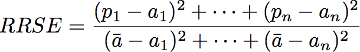
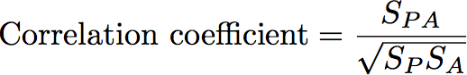
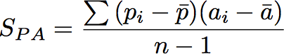
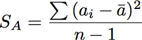
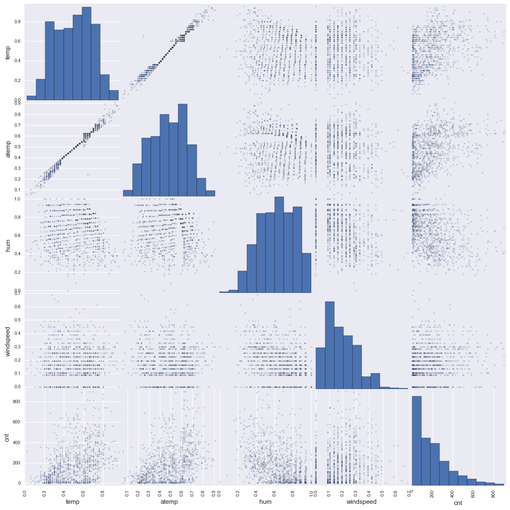
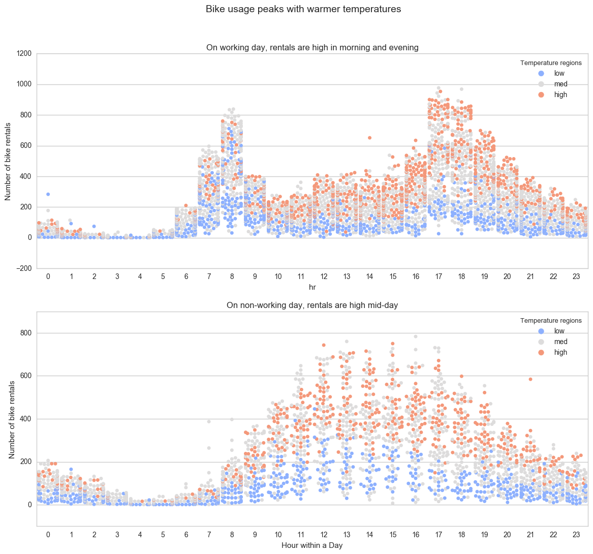
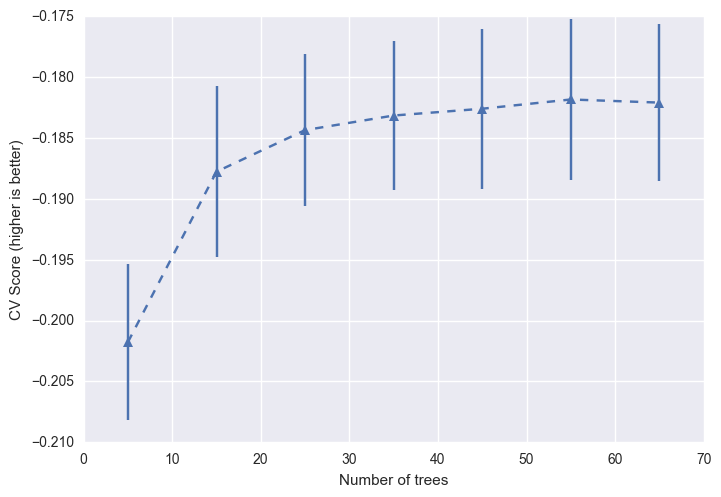
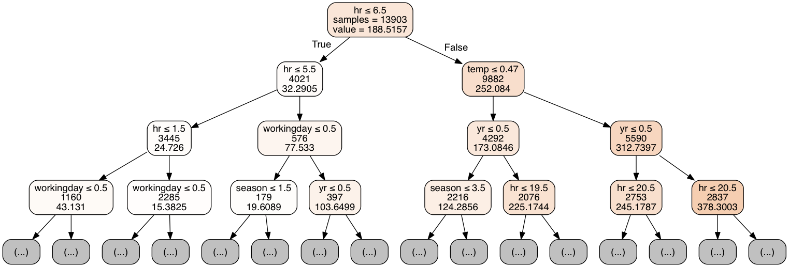
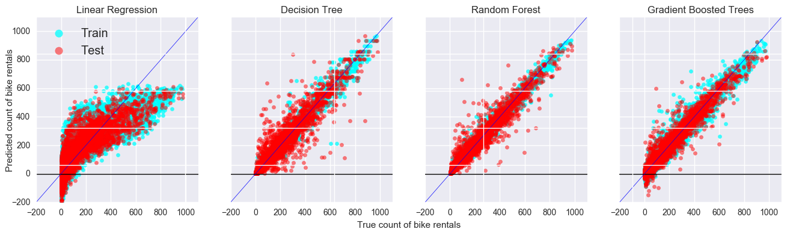
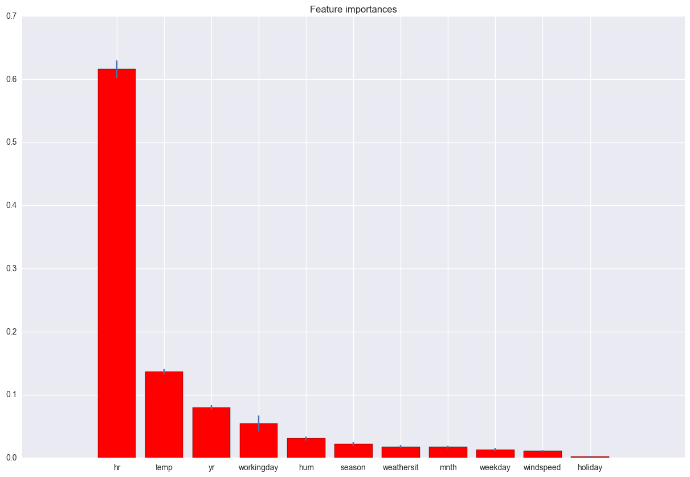

# Machine Learning Engineer Nanodegree
## Capstone Project
S Iyer
May 8th, 2017

## I. Definition

### Project Overview

Bike sharing systems are a new generation of traditional bike rentals where
whole process from membership, rental and return back has become automatic.
These provide an alternative means of transportation in cities by making
bicycling more convenient for users, as they do not need to worry about parking
or theft of their own bicycle. Cities can benefit by providing a new sustainable
transportation option that can increase access to transit, but also reduce
crowding on overburdened transit systems. Today, there exists great interest in
these systems due to their important role in traffic, environmental and health
issues.

The work presented here analyzes the effect of weather on the use of the
Washington, DC, bikeshare system. Hourly weather data, including temperature,
rainfall, snow, wind, fog, and humidity levels are linked to hourly usage data.
This information is useful for understanding bicycling behavior and also for
those planning bikeshare systems in other cities.

### Problem Statement

In Washington, DC, Capital Bikeshare (CaBi) is one of the largest bikeshare
system  in the nation with over 1,200 bicycles at 140 stations(Alta Bicycle
Share, Inc. 2012). The system grew out of an early bikesharing pilot project,
SmartBike D.C., launched in 2008(Alta Bicycle Share, Inc. 2012).

A wealth of data on travel behavior is being collected by these systems and
Capital Bikeshare has made the trip logs of every trip taken in the system
publically available [1]. This analysis exploits the dataset of bicycle trips
made using Capital Bikeshare in order to determine how bicycle usage varies
under different weather conditions and other calendar factors.  We predict the
number of rentals every hour considering various factors like temperature (both
hot and cold), humidity, windspeed, and various other weather conditions that
may affect bicycle usage. We are also able to control for how patterns of
daylight and darkness affect trip behavior.

These results have implications for understanding the sensitivity of bicycle
usage to weather conditions and how this can affect the usefulness of bicycling
as an alternative mode of travel. It is also informative for those planning or
operating bikesharing systems. We'll obtain these relationships by exploring
various machine learning models including linear regression, decision trees,
random forest and gradient boosted trees.

### Metrics

We'll perform the comparison of the models in terms of mean absolute error
\(MAE\), correlation coefficient, relative absolute error \(RAE\), and root
relative squared error \(RRSE\) as described by Fanaee-T et. al.[1].

{height=35}

{ height=35 }

{ height=35 }

where,

{height=35}

{height=35}

{height=35}

In the above equations, $a$ denotes actual target values, $p$ denotes predicted
target values, $\bar{a}$ represents the average of actual target value,
$\bar{p}$ denotes the average of predicted target values and $n$ denotes the
sample size.

This being a regression problem \(predicting count\) we use squared error as the
metric of choice. The relative form of these errors remove the scale of these
counts \(100 vs 100 million\) from the comparisions.

<!-- ()() -->
## II. Analysis

### Data Exploration

The dataset “Bike-Sharing-Dataset” was obtained by the UCI Machine Learning
Repository. This is a collection of databeses, domain theories and data
generators which are used by the machine learning community for empirical
analyses. The archive was created in 1987 by David Aha and fellow graduate
students at UC Irvine. Since then it has been widely used by student, educators
and researchers. The current website was designed in 2007. The UCI Machine
Learning Repository is based on donations of researchers, mostly outside of UCI.

This dataset contains the hourly and daily count of rental bikes between years
2011 and 2012 in Capital bikeshare system with the corresponding weather and
seasonal information. The Laboratory of Artificial Intelligence and Decision
Support \(LIAAD\), University of Porto, aggregated the data on two hourly and
daily basis and then extracted and added the corresponding weather and seasonal
information that were extracted from http://www.freemeteo.com

#### Attribute Information:
The dataset contains the following fields:

- instant: record index
- dteday : date
- season : season (1:springer, 2:summer, 3:fall, 4:winter)
- yr : year (0: 2011, 1:2012)
- mnth : month ( 1 to 12)
- hr : hour (0 to 23)
- holiday : whether day is holiday or not
- weekday : day of the week
- workingday : if day is neither weekend nor holiday is 1, otherwise is 0.
- weathersit :
    - 1: Clear, Few clouds, Partly cloudy, Partly cloudy
    - 2: Mist + Cloudy, Mist + Broken clouds, Mist + Few clouds, Mist
    - 3: Light Snow, Light Rain + Thunderstorm + Scattered clouds, Light Rain + Scattered clouds
    - 4: Heavy Rain + Ice Pallets + Thunderstorm + Mist, Snow + Fog
- temp : Normalized temperature in Celsius. The values are derived via
$(t - t_min)/(t_max - t_min)$, $t_min=-8$, $t_max=+39$ (only in hourly scale)
- atemp: Normalized feeling temperature in Celsius.
The values are derived via $(t-t_min)/(t_max-t_min)$, $t_min=-16$, $t_max=+50$ (only in hourly scale)
- hum: Normalized humidity. The values are divided to 100 (max)
- windspeed: Normalized wind speed. The values are divided to 67 (max)
- casual: count of casual users
- registered: count of registered users
- cnt: count of total rental bikes including both casual and registered

Given below is a random sample of 10 rows from the dataset.

| instant | dteday   | season | yr | mnth | hr | holiday | weekday | workingday | weathersit | temp | atemp  | hum  | windspeed | casual | registered | cnt |
|---------|----------|--------|----|------|----|---------|---------|------------|------------|------|--------|------|-----------|--------|------------|-----|
|  9666 | 2012-02-12 | 1      | 1  |  2   | 16 | 0       | 0       | 0          | 1          | 0.2  | 0.1667 | 0.34 | 0.4627    |  16    | 148        | 164 |
|  1775 | 2011-03-19 | 1      | 0  |  3   | 15 | 0       | 6       | 0          | 1          | 0.5  | 0.4848 | 0.29 | 0.4179    | 170    | 143        | 313 |
| 10487 | 2012-03-18 | 1      | 1  |  3   |  1 | 0       | 0       | 0          | 1          | 0.46 | 0.4545 | 0.82 | 0.1343    |  25    |  88        | 113 |
| 17269 | 2012-12-27 | 1      | 1  | 12   |  9 | 0       | 4       | 1          | 1          | 0.26 | 0.2121 | 0.6  | 0.4925    |   6    | 127        | 133 |
| 13028 | 2012-07-02 | 3      | 1  |  7   |  0 | 0       | 1       | 1          | 2          | 0.76 | 0.7121 | 0.58 | 0.2239    |  12    |  31        |  43 |
|  5540 | 2011-08-23 | 3      | 0  |  8   | 17 | 0       | 2       | 1          | 1          | 0.72 | 0.6515 | 0.34 | 0.2239    | 133    | 339        | 472 |
|  6754 | 2011-10-13 | 4      | 0  | 10   | 23 | 0       | 4       | 1          | 2          | 0.58 | 0.5455 | 0.88 | 0.194     |   2    |  45        |  47 |
| 12572 | 2012-06-13 | 2      | 1  |  6   |  0 | 0       | 3       | 1          | 2          | 0.66 | 0.5909 | 0.94 | 0.194     |   7    |  27        |  34 |
|   929 | 2011-02-11 | 1      | 0  |  2   |  7 | 0       | 5       | 1          | 1          | 0.08 | 0.1667 | 0.73 | 0         |   1    |  73        |  74 |
|   603 | 2011-01-28 | 1      | 0  |  1   |  8 | 0       | 5       | 1          | 2          | 0.16 | 0.197  | 0.86 | 0.0896    |   2    | 155        | 157 |

The table below provides the statistical summary of each categorical column in the dataset.

|        | dteday              | season   | yr    | mnth  |    hr | holiday | weekday | workingday | weathersit |
|--------|---------------------|----------|-------|-------|-------|---------|---------|------------|------------|
| count  | 17379               | 17379    | 17379 | 17379 | 17379 | 17379   | 17379   | 17379      | 17379      |
| unique | 731                 |     4    |     2 |    12 |    24 |     2   |     7   |     2      |     4      |
| top    | 2012-08-29 00:00:00 |     3    |     1 |     7 |    17 |     0   |     6   |     1      |     1      |
| freq   | 24                  |  4496    |  8734 |  1488 |   730 | 16879   |  2512   | 11865      | 11413      |
| first  | 2011-01-01 00:00:00 |   nan    |   nan |   nan |   nan |   nan   |   nan   |   nan      |   nan      |
| last   | 2012-12-31 00:00:00 |   nan    |   nan |   nan |   nan |   nan   |   nan   |   nan      |   nan      |

The table below provides the statistical summary of each continuous column in the dataset.

|        | temp     | atemp    | hum      | windspeed | casual  | registered | cnt  |
|--------|----------|----------|----------|----------|----------|---------|---------|
| count  | 17379    | 17379    | 17379    | 17379    | 17379    | 17379   | 17379   |
| mean   | 0.496987 | 0.475775 | 0.627229 | 0.190098 |  35.6762 | 153.787 | 189.463 |
| std    | 0.192556 | 0.17185  | 0.19293  | 0.12234  |  49.305  | 151.357 | 181.388 |
| min    | 0.02     | 0        | 0        | 0        |   0      |   0     |   1     |
| 25%    | 0.34     | 0.3333   | 0.48     | 0.1045   |   4      |  34     |  40     |
| 50%    | 0.5      | 0.4848   | 0.63     | 0.194    |  17      | 115     | 142     |
| 75%    | 0.66     | 0.6212   | 0.78     | 0.2537   |  48      | 220     | 281     |
| max    | 1        | 1        | 1        | 0.8507   | 367      | 886     | 977     |

For numeric data, the table includes count, mean, std, min, max as well as the
quartiles. For categorical data, the summary includes count, unique, top, and
freq. The 'top' is the most common value and the 'freq' is the most common value’s
frequency. Timestamp column ('dteday') also include the first and last item.

Observations on features:

- No data is missing from any columns.
- There are two columns - 'casual' and 'registered' - that add up to the output column ('cnt').
These columns should not be used in the predictive models and are removed from the data.
- There is one col - 'dteday' - that has the date of rental.
It is redundant since year and month are already provided separately. We choose to remove this column from the data.

### Exploratory Visualization

#### Correlation between continuous features
The plot below shows the pairwise correlation between the continuous features

{width=800}

Observations on correlation plot:

The correlation plot gives the correlation between pairwise columns in the data.
The diagonals of the plot give the distribution of each column. As expected,
'temp' and 'atemp' have a strong correlation and contain redundant information.
We choose to remove 'atemp' from the Bikes dataframe. The remaining continuous
features don't exhibit a correlation between themselves.

#### Relationship with temperature and hour of day

Another relationship that can be visualized is between bike rentals and the
temperature + hour of day. Following swarmplot provides a good visual
representation of this relationship.

{width=1000}

Observations on swarm plot:

The swarm plot provides a categorical scatterplot with non-overlapping points.
The swarm plot is similar to a simple scatterplot, but the points are adjusted
(only along the categorical axis) so that they don’t overlap. This gives a
better representation of the distribution of values, although it does not scale
as well to large numbers of observations (both in terms of the ability to show
all the points and in terms of the computation needed to arrange them). This
style of plot is often called a “beeswarm”. The plot above gives the
distribution of number bike rentals for each hour in the  day. The colors of the
data points indicate the temperature of the day.

We can observed that bike rentals are higher on working days during commute
hours (morning around 8 am and evening around 5 pm).  Compared to that, on a
non-workingday the distribution is flat or more even during the whole day. This
is expected as  the major population would have a need for a bike during those
hours.

Another observation from the plot is that bike rentals are higher when the
temperature is moderately high (above the 3rd quartile). This is consistently
seen  throughout all hours for working and non-working days. This also makes
sense since riding a bike would not be preferred on colder days/nights.

Thus, we can conlude that 'Temp', 'Hours', and 'workingday' are important
features  that we'll see during our model training.

### Algorithms and Techniques

We'll be exploring various learning techniques for this regression problem:

- Linear Regression
- Decision Tree
- Random forest \(bagging\)
- Gradient Boosted Regression Tree \(boosting\)

## III. Methodology

### Data Preprocessing

#### Transformation

There are some columns that require specific type casting or transformations to
ensure correct usage. Furthermore, as noted earlier, some of the columns need
to be excluded to avoid leakage of the response variable in the predictors.
These transformations are documented in the code below.

```
# Create the dataframe bikes for analysis
# Identify which columns are continuous vs categorical variables
# Do not include columns - casual, registered and dteday based on observations

continuous_features = ['temp', 'atemp', 'hum', 'windspeed']
categorical_features = ['season', 'mnth', 'hr', 'season', 'yr', 'holiday',
                        'weekday', 'workingday', 'weathersit']
output = ['cnt']
bikes = bikes[continuous_features + categorical_features + output]
for cat in categorical_features:
    bikes[cat] = bikes[cat].astype('category')
```

#### Dummy encoding

Linear regression requires all columns to be of continuous types. Since we have
categorical features, the best approach is to encode them to integer columns using
dummy encoding using `pandas.get_dummies` function:

```
# Create a new dataframe that is a copy of original
bikes_encoded = bikes.copy()

# Create dummy columns for each categorical variable and update in the new dataframe
for cat in categorical_features:
    dummy_cols = pd.get_dummies(bikes_encoded[cat], prefix=cat)

    # Remove the original categorical variable from the new dataframe
    bikes_encoded.drop(cat, axis=1, inplace=True)

    # Add the dummy variables to the new dataframe
    bikes_encoded = pd.concat([bikes_encoded, dummy_cols], axis=1)
```

### Implementation

#### Libraries

Popular machine learning library scikit-learn was used to execute the algorithms
explored in this work. Scikit-learn provides a range of supervised and
unsupervised learning algorithms via a consistent interface in Python.

It is licensed under a permissive simplified BSD license and is distributed
under many Linux distributions, encouraging academic and commercial use.

The library is built upon the SciPy (Scientific Python) that must be installed
before you can use scikit-learn. This stack that includes:

- NumPy: Base n-dimensional array package
- SciPy: Fundamental library for scientific computing
- Matplotlib: Comprehensive 2D/3D plotting
- IPython: Enhanced interactive console
- Sympy: Symbolic mathematics
- Pandas: Data structures and analysis

The vision for the library is a level of robustness and support required for use
in production systems. This means a deep focus on concerns such as ease of use,
code quality, collaboration, documentation and performance. Although the
interface is Python, c-libraries are leverage for performance such as numpy for
arrays and matrix operations, LAPACK, LibSVM and the careful use of cython.

The metric functions used in this work were implemented in Python, using the
`numpy` library. The implementation was straightforward and documented below:

```
def rae(true_val, pred_val):
    true_mean = true_val.mean()
    diff = np.abs(true_val - pred_val)
    return diff.sum() / np.abs(true_val - true_mean).sum()

def rrse(true_val, pred_val):
    true_mean = true_val.mean()
    diff = np.square(true_val - pred_val)
    return diff.sum() / np.square(true_val - true_mean).sum()

def cc(true_val, pred_val):
    true_mean, pred_mean = true_val.mean(), pred_val.mean()
    spa = ((true_val - true_mean) * (pred_val - pred_mean)).sum()
    sa = np.square(true_val - true_mean).sum()
    sp = np.square(pred_val - pred_mean).sum()
    return spa / np.sqrt(sa * sp)
```

Furthermore, various data transformations including splitting data for train and test
were performed using the popular Pandas library [3]. Libraries used for plotting were
`seaborn`[4] and `matplotlib`[5].

Data extraction

#### Modeling methods

For each model, we employ `scikit-learn` functions that follow a set pattern:
initialize the model and then fit using the data.

- Linear regression

```
----------------------------------------------
from sklearn.linear_model import LinearRegression

# Initiate Model
lin_regr = LinearRegression(normalize=True)
# Train the model
lin_regr.fit(train_X_encoded, train_y_encoded)
----------------------------------------------
```

- Decision Tree

```
----------------------------------------------
from sklearn.tree import DecisionTreeRegressor

# Initiate Model
dec_tree = DecisionTreeRegressor(max_depth=15)

# Train the model
dec_tree.fit(train_X, train_y)
----------------------------------------------
```

- Gradient Boosted Trees

```
----------------------------------------------
from sklearn.ensemble import GradientBoostingRegressor

# Initiate Model
gbr = GradientBoostingRegressor(n_estimators=1000,
                                max_depth=3,
                                learning_rate=0.8)
# Train the model
gbr.fit(train_X, train_y)
----------------------------------------------
```

- Random Forest

```
----------------------------------------------
from sklearn.ensemble import RandomForestRegressor

# Initiate Model
rand_forest = RandomForestRegressor(n_estimators=20, max_depth=15)
# Train the model
rand_forest.fit(train_X, train_y)
----------------------------------------------
```


### Refinement

It's not clear how many trees should be included in the Random Forest. To make
a structured decision, we employ cross validation to perform a grid search across
multiple number of trees.

Specifically we try forests with 5 trees to 65 trees, as shown below.

```
----------------------------------------------
from sklearn import model_selection
from sklearn.ensemble import RandomForestRegressor

# Specify parameters for 10-fold cross validation
kfold = model_selection.KFold(n_splits=10,
                              random_state=1)

print "\n----------------------------------------------"
print "Average validation score:"
cv_mean_scores = []
for n_trees in range(5, 71, 10):
    # Initiate Model
    rand_forest_cv = RandomForestRegressor(n_estimators=n_trees,
                                            max_depth=20,
                                            n_jobs=4)
    # Calculate and print cross-validation score
    results = model_selection.cross_val_score(rand_forest_cv, train_X, train_y, cv=kfold,
                                              scoring=metrics.make_scorer(rae, greater_is_better=False))
    print("For {0} trees is {1}".format(n_trees, results.mean()))
    cv_mean_scores.append((n_trees, results.mean(), results.std()))

----------------------------------------------
```

Results:
```
----------------------------------------------
Average validation score:
For 5 trees is -0.201763886736
For 15 trees is -0.18777456281
For 25 trees is -0.184363069995
For 35 trees is -0.183164892377
For 45 trees is -0.182607144176
For 55 trees is -0.181847832758
For 65 trees is -0.182103770565
----------------------------------------------
```
{width=800}

The cross validation results give the highest score for a forest with 55 trees.
It is, however, important to note that the scores don't increase much after a
certain point. To ensure we use a simple model (to avoid overfitting), while
retaining good accuracy, we pick the simplest model that is within one standard
deviation of the best model. Judging from the figure above, the forest with 25
trees fits the bill.

<!-- ()() -->
## IV. Results

### Model Evaluation and Validation

In this section we provide results and insights into each model.

#### Linear Regression
```
----------------------------------------------
Linear Regression Model details:
LinearRegression(copy_X=True, fit_intercept=True, n_jobs=1, normalize=True)

-----------------------------------------------------------------
R-Square for training data: 0.537756866344

-----------------------------------------------------------------
Summary of predictions for test data:

        Prediction
count  3476.000000
mean    189.386651
std     147.605852
min    -194.500000
25%      78.500000
50%     191.750000
75%     295.000000
max     613.500000

-----------------------------------------------------------------
MAE for training data:  74.9524203409
MAE for test data:      75.9496547756

-----------------------------------------------------------------
RAE for training data:  0.52756830333
RAE for test data:      0.528806780634

-----------------------------------------------------------------
RRSE for training data: 0.313859295957
RRSE for test data:     0.317508260403

-----------------------------------------------------------------
CC for training data:   0.828348632183
CC for test data:       0.826556976405

-----------------------------------------------------------------
```

Analysis for Linear Regression:

- Linear regression prediction includes negative output (which is not valid for `cnt`)
- R2 is close to 0.5, which implies that only 50% of the variance in the data is modeled by the regressor.
- Next step: Try other models to predict `cnt`, like Decision Tree to model greater variability in the data.

#### Decision tree:
```
----------------------------------------------
Decision Tree Model details:
DecisionTreeRegressor(criterion='mse', max_depth=15, max_features=None,
           max_leaf_nodes=None, min_impurity_split=1e-07,
           min_samples_leaf=1, min_samples_split=2,
           min_weight_fraction_leaf=0.0, presort=False, random_state=None,
           splitter='best')

-----------------------------------------------------------------
Summary of predictions for test data:

        Prediction
count  3476.000000
mean    193.543441
std     179.346887
min       1.000000
25%      41.000000
50%     153.000000
75%     290.000000
max     919.000000

-----------------------------------------------------------------
MAE for training data:  9.54837085521
MAE for test data:      33.8699654776

-----------------------------------------------------------------
RAE for training data:  0.0672082074032
RAE for test data:      0.235822894222

-----------------------------------------------------------------
RRSE for training data: 0.0132821892645
RRSE for test data:     0.103842051796

-----------------------------------------------------------------
CC for training data:   0.993336714217
CC for test data:       0.947327629461

-----------------------------------------------------------------
```

Let's visualize the decision tree to get an idea of how it splits on features:

{width=800}

Analysis for Decision Tree:

- Performance for decision tree is much better than linear regression (higher CC and lower error)
- The top of the tree contains nodes that primarily use `hr`, `temp`, `workingday` as
the split features. This indicates the importance of these particular features.
- There are signs of overfitting since the training error is low but the test
error is still reasonably high. We can use ensemble techniques to overcome the
overfitting effects.

<!-- ()() -->
#### Gradient Boosted Trees

```
----------------------------------------------
Gradient Boosted Regression Trees:
GradientBoostingRegressor(alpha=0.9, criterion='friedman_mse', init=None,
             learning_rate=0.8, loss='ls', max_depth=3, max_features=None,
             max_leaf_nodes=None, min_impurity_split=1e-07,
             min_samples_leaf=1, min_samples_split=2,
             min_weight_fraction_leaf=0.0, n_estimators=1000,
             presort='auto', random_state=None, subsample=1.0, verbose=0,
             warm_start=False)

-----------------------------------------------------------------
Summary of predictions for test data:

        Prediction
count  3476.000000
mean    193.249137
std     179.457494
min    -165.000000
25%      43.000000
50%     156.000000
75%     293.250000
max     909.000000

-----------------------------------------------------------------
MAE for training data:  20.8884413436
MAE for test data:      29.9496547756

-----------------------------------------------------------------
RAE for training data:  0.147027667802
RAE for test data:      0.208527353676

-----------------------------------------------------------------
RRSE for training data: 0.029217618587
RRSE for test data:     0.0605477754712

-----------------------------------------------------------------
CC for training data:   0.98529362356
CC for test data:       0.96935713163

-----------------------------------------------------------------
```

Analysis for Gradient Boosted Trees:

- The test error has decreased, with the training and test error closer to each
other. That indicates a drop in variance \(overfitting\).

#### Random Forest
```
----------------------------------------------
Random Forest Model with Cross-Validation details:
RandomForestRegressor(bootstrap=True, criterion='mse', max_depth=20,
           max_features='auto', max_leaf_nodes=None,
           min_impurity_split=1e-07, min_samples_leaf=1,
           min_samples_split=2, min_weight_fraction_leaf=0.0,
           n_estimators=25, n_jobs=3, oob_score=False, random_state=None,
           verbose=0, warm_start=False)

-----------------------------------------------------------------
Summary of predictions for test data:

        Prediction
count  3476.000000
mean    193.671461
std     175.455396
min       1.000000
25%      47.000000
50%     156.500000
75%     287.000000
max     918.000000

-----------------------------------------------------------------
MAE for training data:      10.3020930734
MAE for test data:      26.5261795167

-----------------------------------------------------------------
RAE for training data:      0.0725134390427
RAE for test data:      0.184691077717

-----------------------------------------------------------------
RRSE for training data:     0.00912075968267
RRSE for test data:     0.058918498909

-----------------------------------------------------------------
CC for training data:       0.995516131278
CC for test data:       0.970138513161

-----------------------------------------------------------------
```


### Justification

Given below is a comparison of the performance of four models on the test data set.

| Modeling technique     | mae      | rae     | rrse    | cc     |
|------------------------|----------|---------|---------|--------|
| Linear regression      | 76.726   | 0.5403  | 0.3248  | 0.8217 |
| Decision Tree          | 35.177   | 0.2477  | 0.1177  | 0.9410 |
| Gradient Boosted Tree  | 29.9496  | 0.2085  | 0.06054 | 0.9693 |
| Random Forest          | 26.63    | 0.1876  | 0.06549 | 0.9667 |

{width=1000}

The figure above compares the performance of the four models on the training
(cyan) and testing (red) datasets. The x-axis represents the true count of each
data point and the y-axis represents the prediction for that point. The ideal
model would have all points on the diagonal (blue line). Further, since this is
a count, all points should be positive, implying that the ideal model should
have all prediction points above the x-axis (black line).

We can see from the comparison figure that linear regression performs poorly
when compared to our ideal model. The points have high variability along the
x-axis, with no prediction going over about 600. The linear model also makes the
egregious mistake of predicting negative counts (min value of about -200).

Compared to the linear model, decision tree makes good predictions. Most of the
points lie along the diagonal, but have considerable variability around that line.
The test data points have higher variance than train, again an indicative of
overfitting.

Random forest and Gradient Boosted Trees show better performance than Decision
Tree with lower variability around the diagonal line. The train and test performance
is comparable in either case. The boosting method, however, also falls prey to
predicting negative counts for low cardinality rentals. Considering this
conspicuous inaccuracy, we can conclude that random forest is the best model for
this problem among the four tried in this work.

<!-- ()() -->
## V. Conclusion

### Free-Form Visualization

{width=800}

The figure above gives the importance of each feature used in the final Random
Forest model.  The top five important features in descending order are `hr` (which
hour was the bike rented), `temp` (temperature at the time), `year` (rental year),
`workingday` (whether the day was a working day or not) and `hum` (humidity).
The fact that `hr` and `temp` played the most important part was also apparent
from the swarm plot in the 'Exploratory Visualization' section.

<!-- ()() -->
### Reflection


In the world of bicycle research, data collection is often both challenging and
expensive. Additionally, research regarding the relationship between weather and
cycling is typically conducted based on daily averages and not necessarily at
the precise time that the trip was taken. The latter is more meaningful as
weather can vary throughout the day. Through data collection technology embedded
within bikeshare systems, the ability to understand different impacts on at
least bikeshare trips is possible. The weather of Washington, DC contains almost
all variations. It rains and snows, has cold days and hot days and can be
excessively humid at times. This analysis helps to better document the relative
impact of various weather conditions on bikesharing trips in Washington, DC,
considering the precise weather observation at the time the trip was taken. The
results of this analysis show that fewer trips are made in rain, high humidity,
high wind speeds, and low temperatures, while trips increase with higher
temperatures especially in the evenings.

### Improvement

From our analysis, we concluded that Random Forest model worked better than
Gradient Boosted Trees. In practice, Gradient Boosted Trees provide good
results, but require fine tuning of several hyperparameters including the
number of trees, the depth (or number of leaves), and the shrinkage (or learning
rate). The model in this analysis was tuned significantly which could explain
some of the negative predictions. The author believes boosted trees would yield
best results if tuned correctly.

The `year` feature being important is surprising, but understandable since this is
data for limited years - there could be year-specific trends, which might get
washed out if the analysis is run on multiple years. Re-running this analysis on
a bigger dataset would be an interesting exercise.

An additional analysis that was outside the scope of this study is to embed the
data, with metro and other transportation information. Bike rentals are expected to
have a strong correlation with the availability of public transportation systems.
(Example: do bike rentals increase in evening if public transportation becomes
less frequent?).

### References
[1] Fanaee-T, H. & Gama, J. Prog Artif Intell (2014) 2: 113. doi:10.1007/s13748-013-0040-3
[2] Scikit-learn: Machine Learning in Python, Pedregosa et al., JMLR 12, pp. 2825-2830, 2011.

---------------